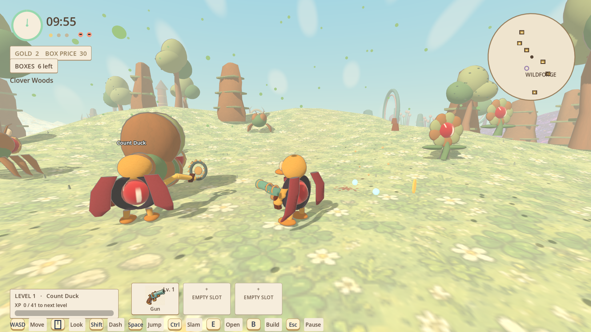
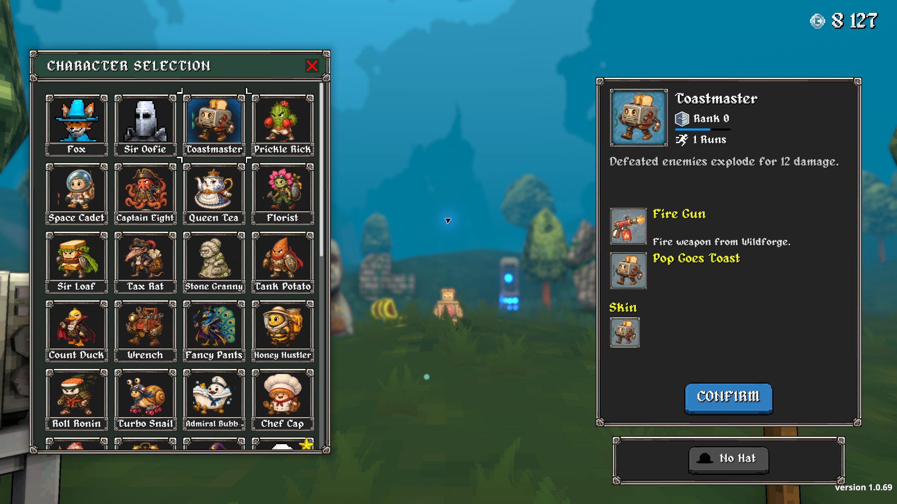
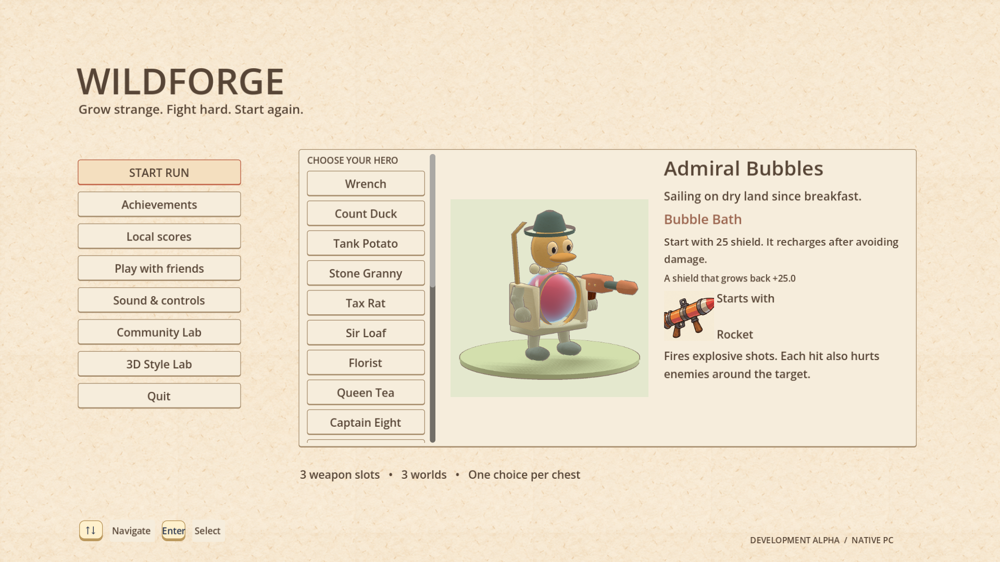
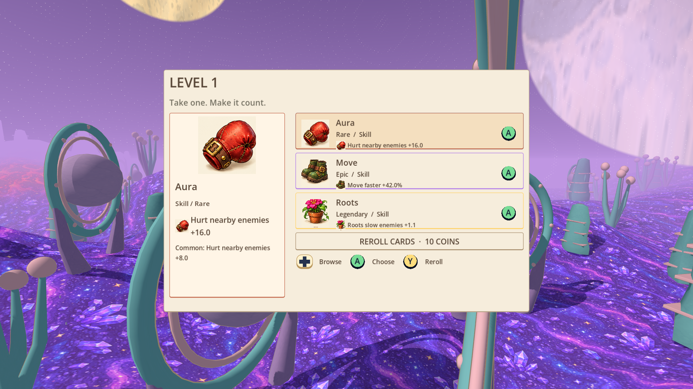

# Wildforge

**Grow strange. Fight hard. Start again.**

A bright 3D survival game where a duck, a loaf of bread and an angry granny are perfectly reasonable hero choices. Explore strange places, grab unpredictable upgrades and become outrageously overpowered before the monsters catch you.

**[Download the Windows build](https://github.com/rytiss78/wildforge/releases/tag/v0.8.2)** · [Play with friends](native/docs/coop.md) · [Share an idea or report a bug](https://github.com/rytiss78/wildforge/issues)

The current build is 0.8.2. See [release and validation notes](native/docs/build-0.8.2.md). Run `build/Wildforge.exe` locally, or unpack the Windows download and run `Wildforge.exe`.



*Two ducks are better than one. Probably.*

## Megabonk Wildforge Mod

Bring Wildforge's strange heroes and upgrades into Megabonk: **21 heroes and perks, 694 cards, 65 weapons, 54 enemy forms and 875 icons**. Mix both rosters and upgrade pools. Wildforge actors show HP inside their model orbs; native Megabonk actors keep their original indicators.

[Download mod 0.3.0](https://github.com/rytiss78/wildforge/releases/tag/megabonk-wildforge-v0.3.0) · [Nexus Mods](https://www.nexusmods.com/megabonk/mods/188) · [Mod installation and compatibility](mods/megabonk-wildforge/README.md) · [Source and merge plan](mods/megabonk-wildforge/PLAN.md) · [Validation evidence](mods/megabonk-wildforge/VERIFICATION.md)



*Actual Megabonk roster with the Wildforge plugin installed. Version 0.3.0 is a development alpha: weapons and enemy AI use native adapters, and full-run balance is still being refined.*
## Your hero. Your chaos.

Choose from 21 ridiculous heroes, each with their own trick. Count Duck steals life. Sir Loaf dashes with a bang. Florist turns footsteps into a dangerous blooming garden. Admiral Bubbles brings a bathtub to the battlefield.

Carry three weapons at once. When two hands aren't enough, grow a third arm. Mix guns, blades, flowers and turrets with fire, poison, frost, ghosts, thorns and strange money tricks. Every upgrade helps you grow stronger; the next chest might send your run in a completely different direction.



*Pick someone sensible. Or bring the bathtub.*

## Find trouble somewhere new

Roam through Clover Woods, Puffcap Marsh, Moon Craters, Cloud City, Candy Hell and Starfall Space. Hunt for treasure, jump over trouble, squash enemies underfoot and face huge bosses as the clock ticks down.

Spend your coins on a chest, choose one of five rewards and keep building your ridiculous little disaster. Chase 108 achievements built around exploration, clever combinations and unusual challenges.



*One choice. More trouble for the monsters.*

## Bring friends

Survive solo or team up with up to three friends. Share the fight, keep your own loot and discover what happens when four questionable heroes meet the same boss.

On the same Wi-Fi, host a party and let friends join from the nearby-party list. Remote friends can join by address using a shared VPN or port forwarding. [Co-op setup](native/docs/coop.md)

## Jump in

Download the Windows ZIP, extract the whole folder and run **Wildforge.exe**. No store account or installation is needed. Keyboard and mouse or Xbox controller both work.

**This is a development alpha.** Expect rough edges and plenty of changes. Your ideas can help shape what comes next: [tell us what you loved, what broke or what would be fun](https://github.com/rytiss78/wildforge/issues).

<details>
<summary><strong>For builders: source, tools and controls</strong></summary>

The game uses Godot **4.7.2**. Open `native/project.godot`, allow the initial import and run the main scene. Node.js is used by the content scripts. All runtime game assets are included; local tool installations and generated caches are excluded.

For Windows packaging, place the console editor at `tools/godot/Godot_v4.7.2-stable_win64_console.exe` and the release template at `tools/godot/templates/windows_release_x86_64.exe`. `scripts/fetch-export-template.py` can obtain the templates. Python and voice models are needed only when regenerating assets.

```powershell
node scripts/native.mjs
./scripts/package-native.ps1
./scripts/package-release.ps1
./scripts/test-coop.ps1 -Packaged -RenderedClient
```

WASD / left stick moves; mouse / right stick looks; Space / A jumps; Shift / RT dashes; Ctrl / B slams; E / X interacts; B / Y opens your build; Escape / Menu pauses. Weapons attack automatically. Florist plants while moving.

Achievements, scores and settings save locally in `%APPDATA%/Godot/app_userdata/Wildforge/career.json`. [Build notes](native/docs/build-0.8.1.md) · [Asset origins](community/ai-content-provenance.md)

</details>
